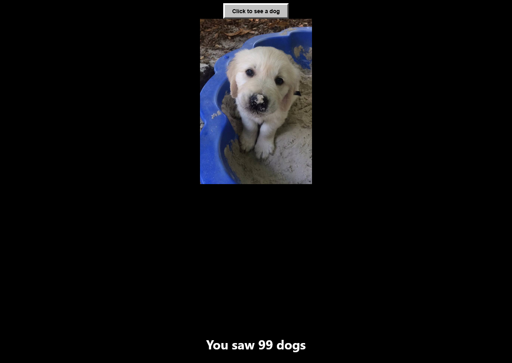

# 🐶 See a Dog

Um site simples e nostálgico criado para demonstrar como eram as páginas da web antigas: uma interface direta, poucos elementos e uma única funcionalidade principal.

Ao clicar em um botão, o site busca e exibe uma foto aleatória de um cachorro. 🐾

O projeto foi desenvolvido utilizando apenas **HTML, CSS e JavaScript puro**, sem frameworks ou bibliotecas externas, mantendo a simplicidade e a essência dos primeiros sites interativos.

---

## 🎥 Demonstração


---

## 🎯 Objetivo do projeto

O **See a Dog** foi criado como uma demonstração de como eram os sites antigos, onde a experiência era mais simples e focada em uma ação específica.

A ideia foi criar uma página leve, funcional e nostálgica, lembrando a época em que os sites eram construídos apenas com as tecnologias fundamentais da web.

---

## 🛠️ Tecnologias utilizadas

* HTML5
* CSS3
* JavaScript (Vanilla JS)

---

## ✨ Funcionalidades

* Botão para gerar uma nova imagem de cachorro
* Busca de imagens aleatórias através de API
* Manipulação do DOM com JavaScript
* Layout simples inspirado em páginas web antigas
* Sem uso de frameworks

---

## 📂 Estrutura do projeto

```
see-a-dog/
│
├── index.html
├── style.css
└── script.js
```

---

## 🚀 Como executar

1. Clone o repositório:

```bash
git clone https://github.com/iamT0ddykk/see-a-dog.git
```

2. Entre na pasta do projeto:

```bash
cd see-a-dog
```

3. Abra o arquivo:

```
index.html
```

no seu navegador.

---

## 🌐 API

O projeto utiliza uma API pública para buscar imagens aleatórias de cachorros.

---

## 📚 Aprendizados

Com este projeto foi possível praticar:

* Manipulação de elementos HTML com JavaScript
* Consumo de APIs utilizando Fetch
* Estrutura básica de uma aplicação web
* Criação de interfaces simples sem dependências

---

## 📄 Licença

Este projeto está sob a licença MIT.
